# ☁️ Cloud Nine Coffee Bar – Self-Ordering System

A self-ordering kiosk for **Cloud Nine Coffee Bar**. Customers browse the menu, customise drinks, pay with Stripe (test mode) and track their order on their phone with a QR code. Baristas manage orders on a live board and admins manage the menu and view sales on a dashboard.

Built with the **MERN stack** (MongoDB, Express, React, Node.js) and **Stripe Checkout in test mode**. No real money is ever charged.

| | |
|---|---|
| **Author** | S. S. M. Chathuranganee ([@Chathu20](https://github.com/Chathu20)) |
| **Team Lead** | Sithum Buddhika |
| **Organisation** | Gamage Recruiters – Team 409 |
| **Type** | Individual assignment |

---

## 📑 Contents

1. [Screenshots](#-screenshots)
2. [Features](#-features)
3. [Tech stack](#-tech-stack)
4. [Project structure](#-project-structure)
5. [Getting started](#-getting-started)
6. [Environment variables](#-environment-variables)
7. [Demo accounts and test card](#-demo-accounts-and-test-card)
8. [Opening the tracking page on a phone (Cloudflare Tunnel)](#-opening-the-tracking-page-on-a-phone-cloudflare-tunnel)
9. [Troubleshooting](#-troubleshooting)
10. [API overview](#-api-overview)
11. [How the main parts work](#-how-the-main-parts-work)
12. [Security](#-security)
13. [Git workflow](#-git-workflow)
14. [Known limitations](#-known-limitations)

---

## 📸 Screenshots

### Customer kiosk

| Welcome screen | Menu |
|---|---|
| 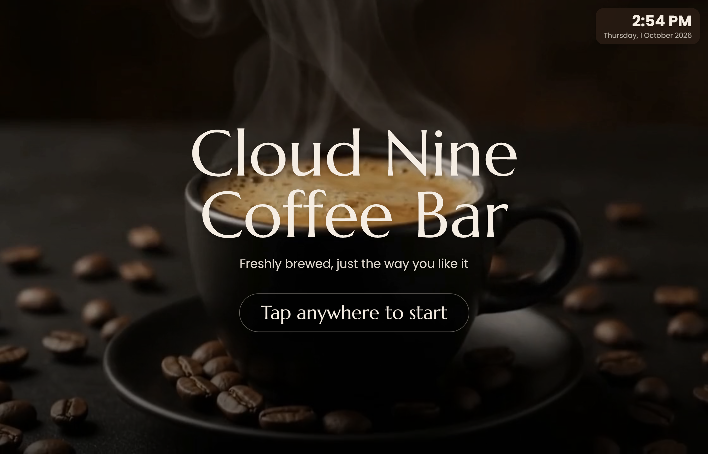 | 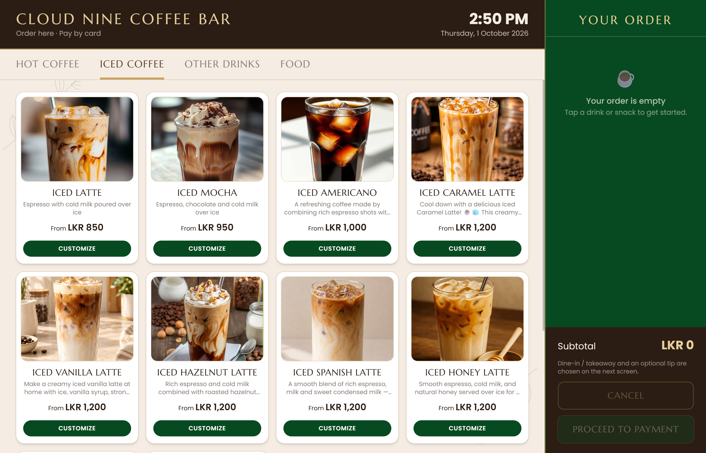 |

| Customise a drink | Checkout |
|---|---|
| 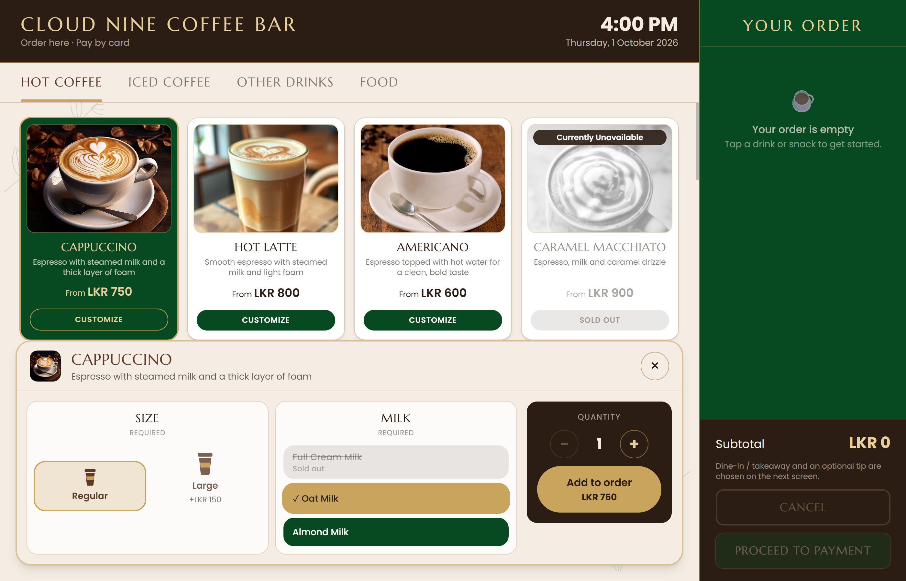 | 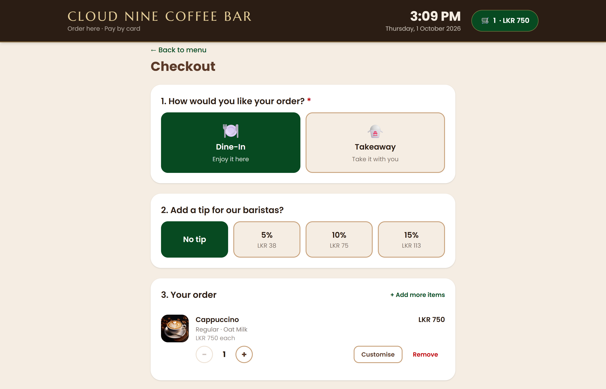 |

| Checkout – editing the order | Stripe test payment |
|---|---|
| 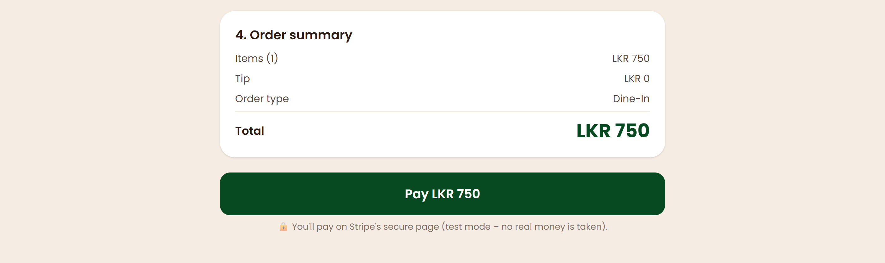 | 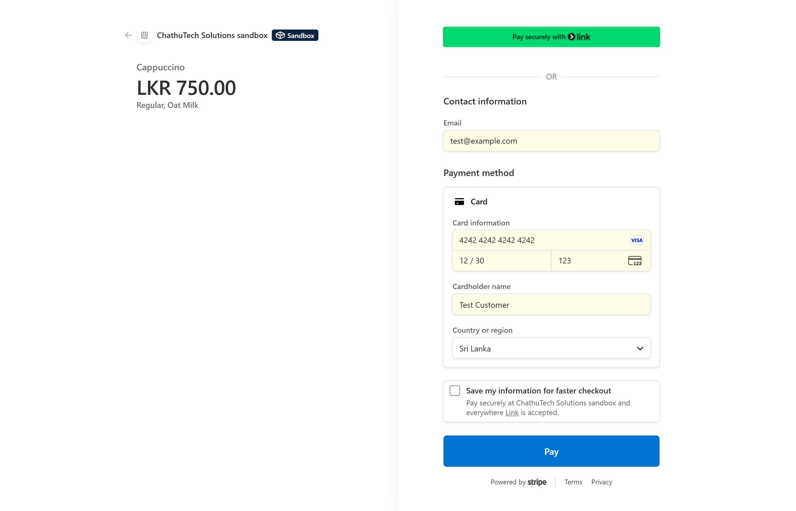 |

| Order confirmation | QR code for order tracking |
|---|---|
| 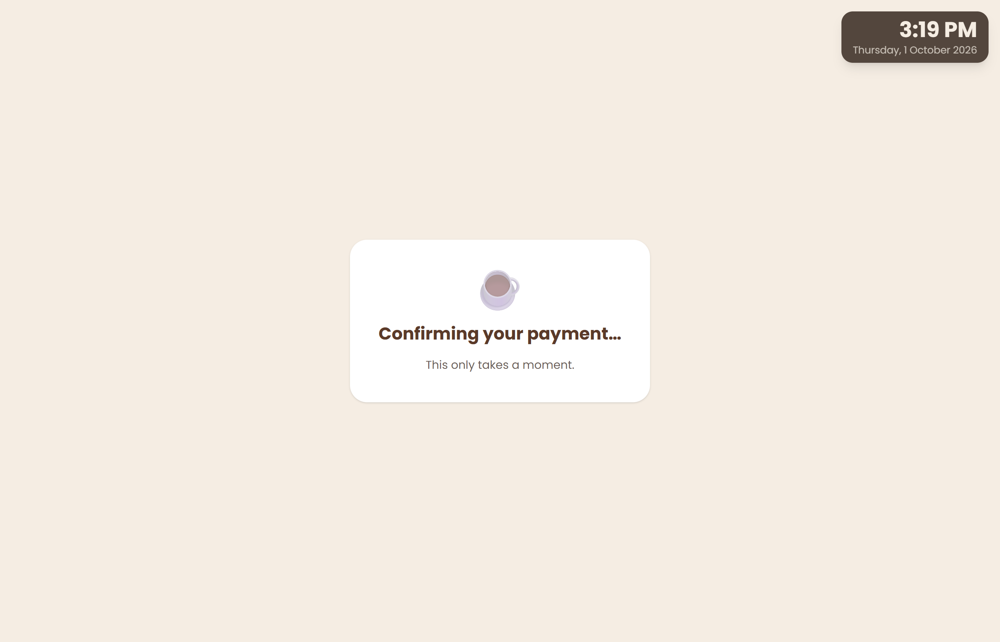 | 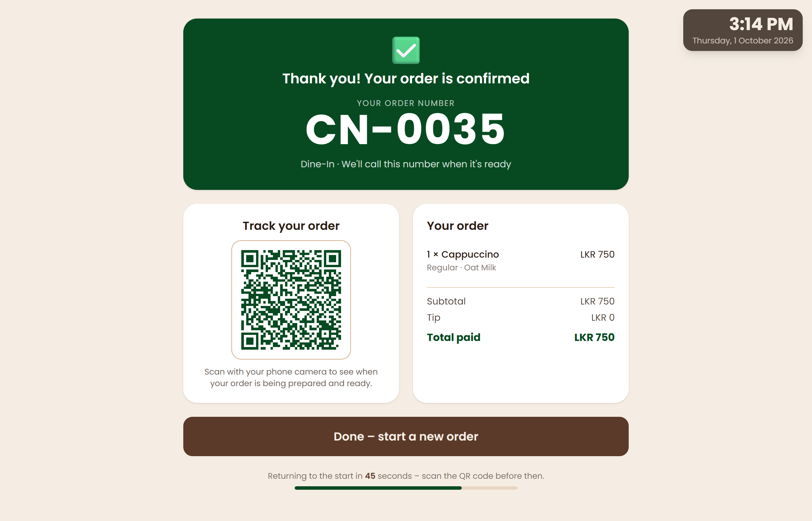 |

| Order tracking on a phone | |
|---|---|
| 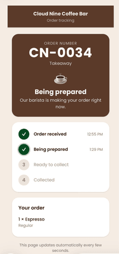 | |

### Staff – Barista

| Staff login | Barista order board |
|---|---|
| 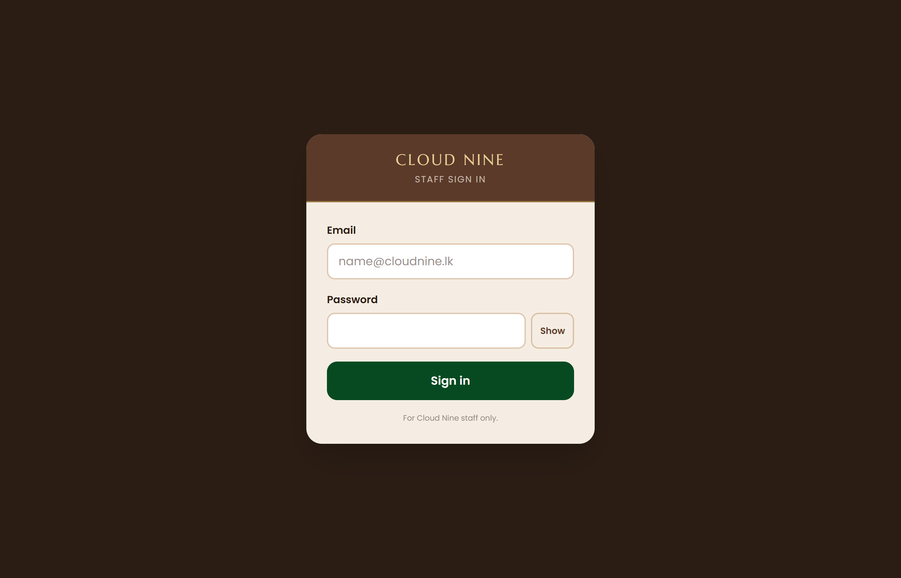 | 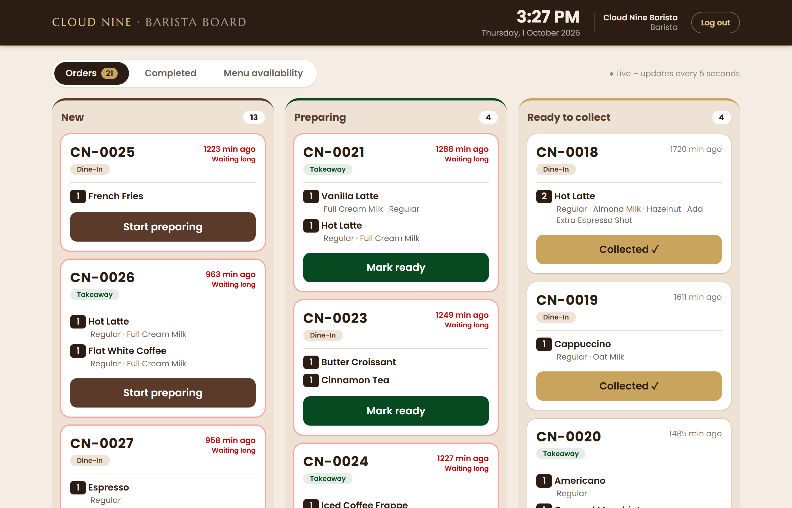 |

| Availability panel | Sold-out item shown live on the kiosk |
|---|---|
| 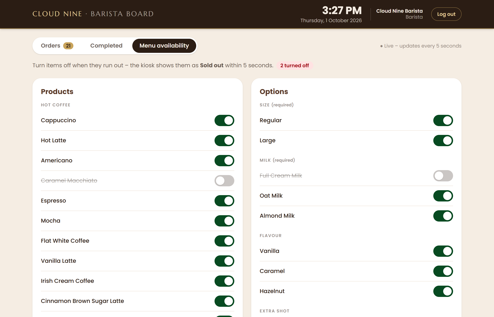 | 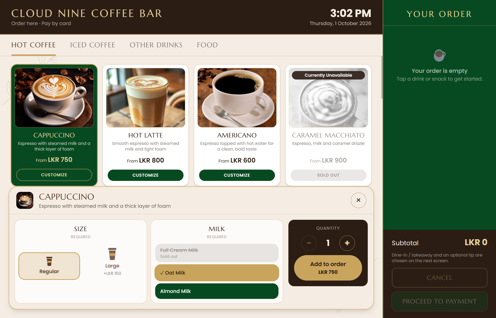 |

### Staff – Admin

| Sales dashboard | Menu management |
|---|---|
| 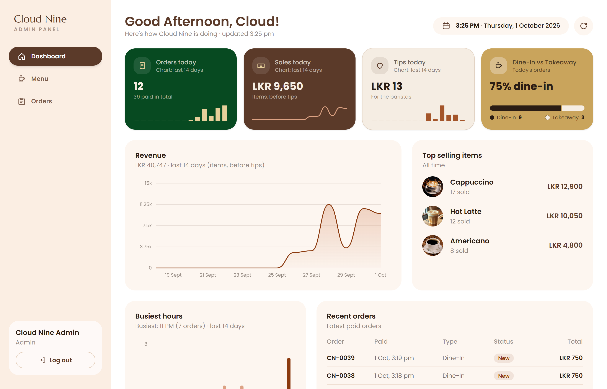 | 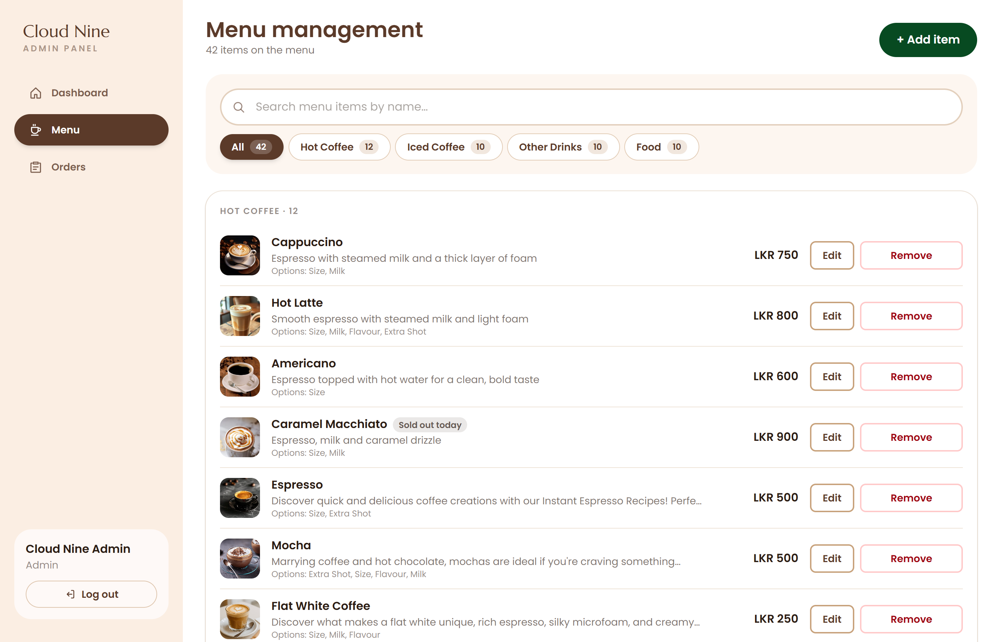 |

| Add a new menu item | Edit a menu item (image link or upload) |
|---|---|
| 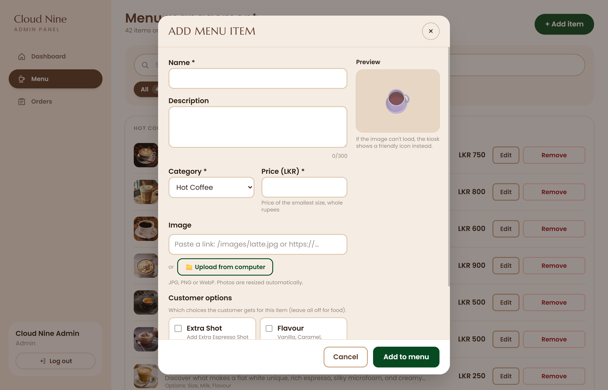 | 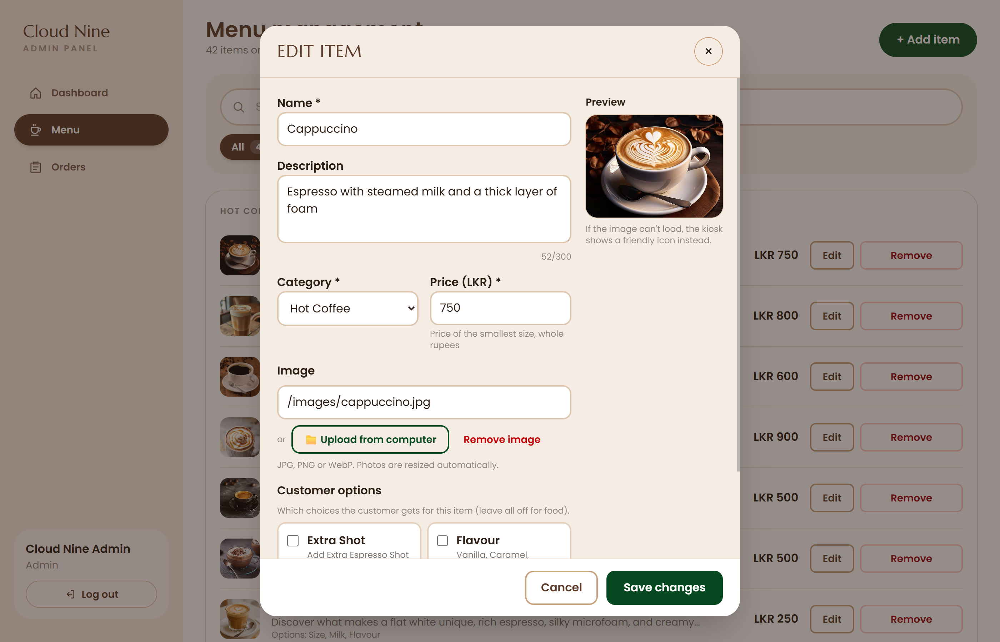 |
### Development workflow

| Pull requests into `develop` |
|---|
| 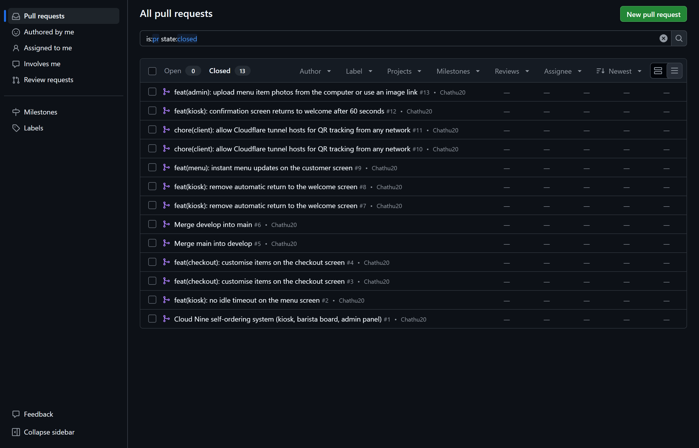 |

---

## ✨ Features

### Customer kiosk
- **Welcome screen** with a looping coffee-steam video and a live clock. Tap anywhere to start.
- **Menu** grouped into Hot Coffee, Iced Coffee, Other Drinks and Food, with category tabs.
- **Drink customisation**: size, milk and flavour options with price changes shown live.
- **Order sidebar / cart** with quantity controls; the cart is kept in `localStorage`.
- **Checkout** in four cards: order type (Dine-in / Takeaway), tip (0 / 5 / 10 / 15 %), an editable "Your order" list (change options or quantity without going back) and an order summary.
- **Stripe Checkout (test mode)** for payment.
- **Order confirmation** with an order number (e.g. `CN-0042`) and a **QR code**. The screen returns to the welcome screen automatically after **60 seconds** with a visible countdown.
- **Order tracking page** on the customer's phone (from the QR code) that refreshes every 5 seconds: New → Preparing → Ready → Completed.
- **Live menu updates**: when a barista marks an item sold out, or an admin changes the menu, every kiosk updates within about a second (no reload).

### Barista
- Separate staff login (JWT).
- **Order board** with columns for New, Preparing and Ready; refreshes every 5 seconds.
- One-tap status changes. Two baristas can't move the same order twice (conflicts return `409`).
- **Availability panel**: mark a product or a single option (e.g. Oat Milk) as sold out / available.

### Admin
- **Sales dashboard**: today's revenue, order count, average order value, sales over time, orders by hour, top-selling items with images and category breakdown (times in Sri Lanka time, `Asia/Colombo`).
- **Menu management**: add, edit, archive and restore items, with **category filters** and **search**.
- **Product images**: paste an image link **or upload a photo from the computer**. Photos are resized in the browser before upload.
- Admins can also open the order board.

---

## 🧰 Tech stack

| Layer | Technology | Why it was chosen |
|---|---|---|
| Frontend | **React 19** + **Vite 8** | Fast dev server, simple component model |
| Styling | **Tailwind CSS v4** (`@theme` colour tokens) | Consistent coffee-shop palette without writing lots of CSS |
| Routing | **React Router 7** | Separate customer, barista and admin areas |
| HTTP | **axios** | One place to attach the staff token to every request |
| QR code | **qrcode.react** | Generates the tracking QR code in the browser |
| Charts | Hand-built **SVG** components (`Charts.jsx`) | No extra chart library; full control over colours and size |
| Backend | **Node.js** + **Express 5** (ES modules) | Simple REST API; Express 5 passes async errors to the error handler |
| Database | **MongoDB Atlas** + **Mongoose 9** | Flexible documents for products with option groups and orders |
| Payments | **Stripe Checkout** (test mode) | Secure hosted payment page; card details never touch our server |
| Auth | **JWT** + **bcryptjs** | Stateless staff login; passwords stored as hashes |
| Uploads | **multer** | Receives product photos in memory so they can be checked first |
| Live updates | **Server-Sent Events** (SSE) | One-way server → kiosk messages without extra libraries |
| Linting | **oxlint** | Fast lint checks for the client |

---

## 🗂️ Project structure

```
cloud-nine-coffee-self-ordering-system/
├── client/                      # React + Vite frontend
│   ├── public/
│   │   ├── images/              # Menu item photos
│   │   └── videos/              # Welcome screen videos
│   ├── src/
│   │   ├── api/client.js        # axios instance + staff token per role
│   │   ├── components/
│   │   │   ├── customer/        # ProductCard, ItemCustomizer, OrderSidebar, ...
│   │   │   └── staff/           # OrderCard, AvailabilityPanel, Charts, ProductFormDialog, ...
│   │   ├── context/             # AuthContext, CartContext, MenuContext
│   │   ├── layouts/             # CustomerLayout, StaffLayout
│   │   ├── pages/
│   │   │   ├── customer/        # Welcome, Menu, Cart, Checkout, OrderSuccess, TrackOrder
│   │   │   └── staff/           # StaffLogin, BaristaBoard, AdminDashboard, AdminMenu
│   │   └── utils/
│   ├── .env.example
│   └── vite.config.js           # /api proxy → :5000, tunnel hosts allowed
├── server/                      # Express API
│   ├── src/
│   │   ├── config/              # db.js, stripe.js
│   │   ├── controllers/         # menu, order, staffOrder, availability, admin, upload, auth
│   │   ├── middleware/          # auth.js (protect/authorize), menuChanged.js
│   │   ├── models/              # User, Product, OptionGroup, Order, Counter
│   │   ├── routes/              # menu, auth, orders, staff, admin
│   │   ├── services/            # pricing.js, menuEvents.js (SSE)
│   │   ├── seed/                # data.js, seed.js
│   │   ├── utils/AppError.js
│   │   ├── app.js
│   │   └── server.js
│   └── .env.example
├── docs/screenshots/            # Images used in this README
└── README.md
```

---

## 🚀 Getting started

### Prerequisites
- **Node.js 20+** and npm
- A **MongoDB Atlas** cluster (free tier is fine)
- A **Stripe** account in **test mode** (secret key starts with `sk_test_`)
- Optional: **cloudflared** to open the tracking page from a phone on another network

### 1. Clone the repository

```bash
git clone https://github.com/gamage-recruiters-team409/cloud-nine-coffee-self-ordering-system-Chathuranganee.git
cd cloud-nine-coffee-self-ordering-system-Chathuranganee
```

### 2. Set up the server

```bash
cd server
npm install
```

Copy `server/.env.example` to `server/.env` and fill in your own values (see [Environment variables](#-environment-variables)).

Load the menu, option groups and demo staff accounts:

```bash
npm run seed
```

Start the API (runs on http://localhost:5000):

```bash
npm run dev
```

### 3. Set up the client

Open a **second terminal** from the project root:

```bash
cd client
npm install
```

Copy `client/.env.example` to `client/.env` and set `VITE_PUBLIC_URL`. Then start the app (runs on http://localhost:5173):

```bash
npm run dev
```

> Run `npm` commands inside `server/` or `client/`. The project root has no `package.json`, so `npm run dev` there fails with `ENOENT`.

### 4. Open the app

| Screen | URL |
|---|---|
| Customer kiosk | http://localhost:5173 |
| Staff login | http://localhost:5173/staff/login |
| Barista board | http://localhost:5173/barista |
| Admin dashboard | http://localhost:5173/admin |
| Admin menu | http://localhost:5173/admin/menu |
| API health check | http://localhost:5000/api/health |

---

## 🔐 Environment variables

### `server/.env`

| Variable | Example | Description |
|---|---|---|
| `PORT` | `5000` | API port |
| `CLIENT_URL` | `http://localhost:5173` | Allowed CORS origin and where Stripe returns after payment |
| `MONGO_URI` | `mongodb+srv://...` | MongoDB Atlas connection string |
| `JWT_SECRET` | *(long random string)* | Secret used to sign staff login tokens |
| `JWT_EXPIRES_IN` | `12h` | How long a staff login lasts |
| `STRIPE_SECRET_KEY` | `sk_test_...` | Stripe **test** secret key |

Generate a strong `JWT_SECRET`:

```bash
node -e "console.log(require('crypto').randomBytes(48).toString('hex'))"
```

### `client/.env`

| Variable | Example | Description |
|---|---|---|
| `VITE_PUBLIC_URL` | `http://192.168.1.41:5173` or `https://xxxx.trycloudflare.com` | Address the QR code points to, so a phone can open the tracking page |

> `.env` files are listed in `.gitignore` and are never committed. Only the `.env.example` files are in the repository.

---

## 👤 Demo accounts and test card

Created by `npm run seed`:

| Role | Email | Password |
|---|---|---|
| Barista | `barista@cloudnine.lk` | `Barista@123` |
| Admin | `admin@cloudnine.lk` | `Admin@123` |

Stripe test card:

| Field | Value |
|---|---|
| Card number | `4242 4242 4242 4242` |
| Expiry | Any future date, e.g. `12/34` |
| CVC | Any 3 digits, e.g. `123` |
| Name / postcode | Anything |

---

## 📱 Opening the tracking page on a phone (Cloudflare Tunnel)

The QR code opens `VITE_PUBLIC_URL/track/<token>`. There are two ways to make that address reachable from a phone.

### Option A – Same Wi-Fi

1. Run `ipconfig` (Windows) and find **Wireless LAN adapter Wi-Fi → IPv4 Address**, e.g. `192.168.1.41`.
2. In `client/.env` set `VITE_PUBLIC_URL=http://192.168.1.41:5173`.
3. Restart the client (`Ctrl + C`, then `npm run dev`).

The phone must be on the same Wi-Fi as the computer.

### Option B – Any network (mobile data), without deploying

A Cloudflare quick tunnel gives the local app a temporary public `https://` address.

1. Install cloudflared (Windows):
   ```powershell
   winget install --id Cloudflare.cloudflared
   ```
2. With the server and client both running, open a **third terminal** and run:
   ```powershell
   cloudflared tunnel --url http://localhost:5173
   ```
3. Copy the address it prints, e.g. `https://example-words-here.trycloudflare.com`.
4. In `client/.env` set:
   ```
   VITE_PUBLIC_URL=https://example-words-here.trycloudflare.com
   ```
5. Restart the client (`Ctrl + C`, then `npm run dev`). Vite only reads `.env` when it starts.
6. Place an order and scan the QR code with the phone.

Why this works: the tunnel forwards requests to Vite on port 5173, and Vite forwards `/api` requests to the Express server on port 5000. So one address serves both the page and the API. `vite.config.js` allows `.trycloudflare.com` hosts.

> - A quick tunnel gets a **new address every time** it starts. Repeat steps 3–5 each time.
> - Keep the tunnel terminal open while testing. `Ctrl + C` or closing it stops the tunnel.
> - **Stop the tunnel when you are not demoing**, because the app is public while it runs.

---

## 🛠️ Troubleshooting

| Problem | Cause | Fix |
|---|---|---|
| `npm error enoent Could not read package.json` | `npm run dev` was run in the project root | `cd server` or `cd client` first |
| `cloudflared : The term 'cloudflared' is not recognized` | The terminal was opened before cloudflared was installed, so it still has the old PATH | Close VS Code completely and reopen it, **or** run cloudflared by its full path (below) |
| Phone shows **Error 1033** | The tunnel was stopped, or the QR code uses an old tunnel address | Start the tunnel again, put the new address in `VITE_PUBLIC_URL`, restart the client |
| `Blocked request. This host is not allowed` | Vite blocks unknown host names | Already handled by `allowedHosts: [".trycloudflare.com"]` in `client/vite.config.js` |
| Menu is empty | The database has no data yet | Run `npm run seed` in `server/` |
| Stripe error on checkout | Missing or wrong key | Check `STRIPE_SECRET_KEY` in `server/.env` starts with `sk_test_` and restart the server |

Run cloudflared by its full path (Windows, without restarting the terminal):

```powershell
$cf = (Get-ChildItem "C:\Program Files", "C:\Program Files (x86)", "$env:LOCALAPPDATA\Microsoft\WinGet" -Recurse -Filter cloudflared.exe -ErrorAction SilentlyContinue | Select-Object -First 1).FullName
& $cf tunnel --url http://localhost:5173
```

---

## 🔌 API overview

All routes start with `/api`.

### Public (customer)

| Method | Route | Description |
|---|---|---|
| GET | `/health` | Server health check |
| GET | `/menu` | Orderable menu grouped by category |
| GET | `/menu/events` | Live menu updates (Server-Sent Events) |
| POST | `/orders` | Create an order and a Stripe Checkout session |
| GET | `/orders/confirm?session_id=...` | Confirm payment after Stripe redirects back |
| GET | `/orders/track/:token` | Order status for the tracking page |

### Auth

| Method | Route | Description |
|---|---|---|
| POST | `/auth/login` | Staff login, returns a JWT |
| GET | `/auth/me` | Current staff user (token required) |

### Staff (Barista or Admin)

| Method | Route | Description |
|---|---|---|
| GET | `/staff/orders` | Active orders for the board |
| PATCH | `/staff/orders/:id/status` | Move an order to its next status |
| GET | `/staff/availability` | Products and options with availability |
| PATCH | `/staff/products/:id/availability` | Mark a product sold out / available |
| PATCH | `/staff/option-groups/:groupId/options/:optionId/availability` | Mark an option sold out / available |

### Admin only

| Method | Route | Description |
|---|---|---|
| GET | `/admin/dashboard` | Sales dashboard data |
| GET | `/admin/products` | All products (including archived) |
| POST | `/admin/products` | Create a product |
| PATCH | `/admin/products/:id` | Update a product |
| DELETE | `/admin/products/:id` | Archive a product (soft delete) |
| PATCH | `/admin/products/:id/restore` | Restore an archived product |
| POST | `/admin/uploads` | Upload a product photo |
| GET | `/admin/option-groups` | Option groups for the product form |

---

## ⚙️ How the main parts work

**Prices are calculated on the server.** The client sends only product IDs, option IDs and quantities. `services/pricing.js` loads the real prices from the database, so a customer can't change the price in the browser.

**Payment flow.**
1. `POST /api/orders` saves the order as `PENDING_PAYMENT` and creates a Stripe Checkout session.
2. The customer pays on Stripe's page.
3. Stripe redirects to `/order/success?session_id=...`, and the client calls `/api/orders/confirm`.
4. The server asks Stripe whether the session is paid. It then marks the order `PAID` / `NEW` in one atomic update, so a page refresh can't confirm it twice.

**Order numbers.** A `Counter` document is increased with `$inc`, which is atomic, so two orders never get the same number (`CN-0042`, `CN-0043`, ...).

**QR tracking.** Each order gets a random UUID `trackingToken`. The QR code holds `VITE_PUBLIC_URL/track/<token>`. The token can't be guessed, so customers can only see their own order.

**Status changes.** The server only allows New → Preparing → Ready → Completed. The update checks the current status (`{ _id, status: from }`), so if two baristas tap at the same time only one wins; the other gets `409 Conflict`.

**Live menu.** Kiosks keep a Server-Sent Events connection to `/api/menu/events`. After any successful menu change, the `announceMenuChange` middleware sends a `menu-changed` event (changes within 150 ms are grouped into one), and the kiosk reloads the menu. A 30-second refresh is kept as a safety net.

**Soft delete.** Archiving sets `isArchived: true` instead of deleting, so old orders still show the item name and the admin can restore it.

**Image upload.** The browser shrinks the photo to at most 1000 px (JPEG). The server accepts it only if the file's first bytes really are JPG, PNG or WebP (not just the file name). It is stored with a random UUID name in `server/uploads/` (max 3 MB) and served with `X-Content-Type-Options: nosniff`.

---

## 🛡️ Security

- Secrets live only in `server/.env`, which is git-ignored.
- Stripe runs in **test mode** (`sk_test_`); card details are entered on Stripe's page, never on our server.
- Staff passwords are hashed with **bcrypt**; staff routes need a valid **JWT** and the right role (`BARISTA` / `ADMIN`).
- Barista and admin logins keep **separate tokens**, so both can be open in the same browser.
- Prices and totals are always recalculated on the server.
- Uploads are checked by file content, size-limited and renamed.
- Central error handler with `AppError`, so internal errors are not leaked to the client.

---

## 🌿 Git workflow

- **`main`**: stable, released code only.
- **`develop`**: integration branch; all features are merged here first.
- **Feature branches** from `develop`: `feature/...`, `fix/...`, `chore/...`, `docs/...`.
- Every change goes through a **pull request into `develop`**, merged with a merge commit, and the branch is deleted afterwards.
- Releases are merged from `develop` into `main` with a release PR.
- Commit messages follow **Conventional Commits**, e.g. `feat(admin): upload menu item photos`, `fix(kiosk): ...`, `docs: ...`.

```bash
git checkout develop
git pull origin develop
git checkout -b feature/my-change
# ...make changes...
git add .
git commit -m "feat(scope): short description"
git push -u origin feature/my-change
# open a PR into develop on GitHub
```

---

## ⚠️ Known limitations

- Payments use **Stripe test mode** only; no real payments.
- Payment is confirmed when the customer returns from Stripe (no Stripe webhook). If the customer closes the browser during payment, the order stays `PENDING_PAYMENT`.
- The barista board and the tracking page refresh every 5 seconds (polling), not instantly.
- Uploaded photos are stored on the server's disk (`server/uploads/`), which suits a single server but not cloud hosting without a file store.
- Cloudflare quick tunnels are for testing and demos; the address changes every time.
- The app is not deployed; it runs locally.

---

## 👩‍💻 Author

**S. S. M. Chathuranganee**
GitHub: [@Chathu20](https://github.com/Chathu20)
Individual assignment for Gamage Recruiters – Team 409.